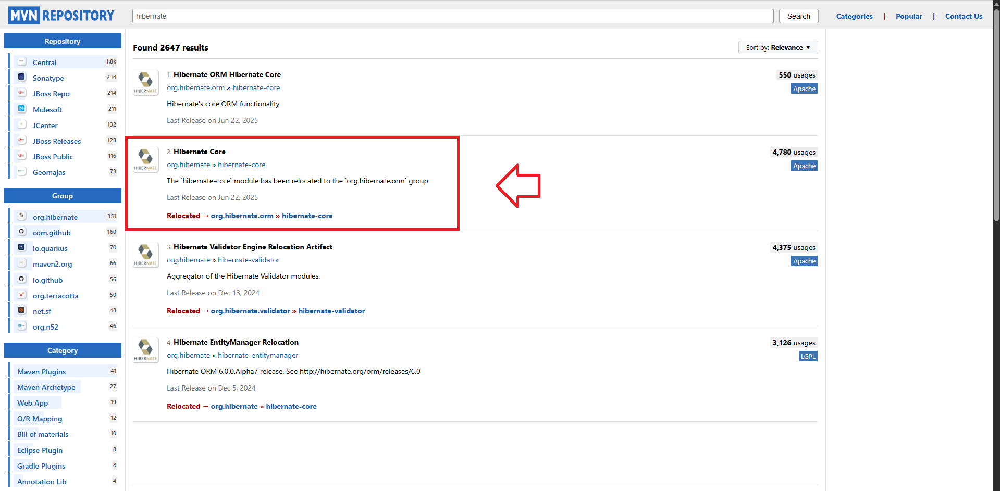
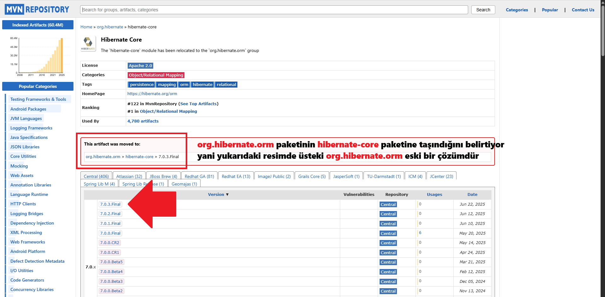
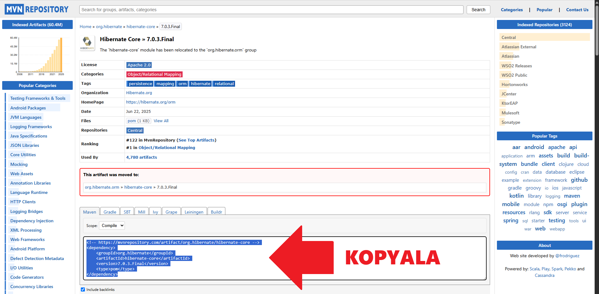

# ORM (Object Relational Mapping)

<a id="contents"></a>
## 📑 İçindekiler

- [Temel Kavramlar](#basic-concepts)  
    - [OOP Nedir](#what-is-oop)
    - [Database Nedir?](#what-is-database)
    - [ORM Nedir?](#what-is-orm)  
    - [ORM Avantajları](#orm-advantages)  
    - [ORM Dezavantajları](#orm-disadvantages)  
- [Popüler ORM Framework'leri](#popular-frameworks)  
    - [Java ORM Çözümleri](#java-orm)  
        - [JPA](#jpa)  
        - [Hibernate](#hibernate)  
- [ORM Kullanım Senaryoları](#use-cases)  
- [İleri Düzey Konular](#advanced-topics)


---

<a id="basic-concepts"></a>
## 1. Temel Kavramlar

<a id="what-is-oop"></a>
### 1.1 OOP Nedir?
OOP (Nesne Yönelimli Programlama), imsindende anlaşılacağı üzere nesnelere dayalı bir programlama tekniğidir. OOP veriler veya nesneler etrafında düzenleyen bir programlama modelidir. Bir nesne, niteliklere(properties) ve davranışlara(functions) sahip bir alan olarak tanımlanabilir.

Bir çok Nesne Tabanlı Programlama dili bulunmaktadır bunlardan bazıları aşağıda verilmiştir.


Nesne yönelimli programlama dillerinde genel olarak mantık aynıdır ve bu mantık 4 parçaya ayrılır : 
- Snıflar : Nesneleri oluşturmak için kullanılan bir taslak.
- Nesneler : Özel olarak tanımlanmış verilerlerden oluşan bir sınıf örneğidir.
- Yöntemler : Nesnelerin gerçekleştirebildiği işlevlerlerdir.
- Nitelikler : Bir nesnede bulunan özelliklerdir.

Örnek : Bir öğrenci sistemi oluşturmak istiyoruz ne yapmamız gerekir?
Öncelikle bir öğrenci snıfı oluşturmalıyız içinde her öğrencide olması gereken nitelikler ve işlevlerin tanımlandığı bir öğrenci sınıfı oluşturalım.

```java
public class Student {

    //Bunlar bütün öğrencilerimizde olması gereken ortak nitelikler
    //Öncelikle bunları tanımlıyoruz
    public String name;
    public String lastName;
    public int age;
    public Long schoolNo;
    public String className;

    //Her öğrencimiz yapabileceği işlevler
    public void goingToSchool(){
        //Yapılacak işlemler
    }
    public void leavingSchool(){
        //Yapılacak işlemler
    }
}
```

Aslında şuan hiç bir öğrenci oluşturmadık sadece öğrencilerde nelerin olması gerektiğini yaptım hadi şimdi öğrenci oluşturalım.

```java
public class Main {
    public static void main(String[] args) {
        
        //Öğrencileri(nesneleri) oluşturma ve niteliklerini doldurma
        Student student = new Student();
        student.name = "Muhammed";
        student.lastName = "Utar";
        student.age = 18;
        student.schoolNo = 24050911001L;
        student.className = "12A";

        Student student1 = new Student();
        student1.name = "Furkan";
        student1.lastName = "Boran";
        student1.age = 18;
        student1.schoolNo = 24050911056L;
        student1.className = "12A";
        
        //Onların işlevlerini(fonksiyonlarını) kullanma
        student.goingToSchool();
        student1.leavingSchool();        
    }
}
```

İki tane öğrenci oluşturdum *Muhammed* isimli öğrenci okula girdi ve *Furkan* isimli öğrenci ise okuldan çıkış yaptı. İşte OOP'nin en ilkel ve sade halinin bir örneği bu şekilde.

<a id="what-is-database"></a>
### 1.2 Veritabanı Nedir?
Veritabanı, bir bilgisayar sisteminde depolanan yapılandırılmış bilgi veya organize edilmiş bir koleksiyon kümesidir. Aslında kullanıcıların sisteme girdikleri biglilerini, programın verilerini ve ortak verileri barındıran ve istediğimiz zaman onlara erişmemizi sağlayan yapılardır.

Aşağıda bu databaselerin en yaygınlarının gruplandırılmış hali bulunmaktadır.


**Neden veritabanlarına ihtiyaç duyarız?**  
Çünkü programlar uygulamalar çalıştıklarında bilgileri RAM(Geçici Bellek) de tutarlar veya kişisel depolama alanımıza kaydeder. Ram deki bilgiler program veya bilgisayar kapatıldığında silinir. Kişisel depolama alanımızdaki verilere ise sadece biz kendi bilgisayarımızdan erişebiliriz bu yüzden her yerden erişilebilir veritabanlarına ihtiyaç duyulmuştur.

Örnek olarak yukardaki örneğimden devam edeceğim öğrenci sınıfımızı ve nesnelerimiz oluşturduk ve kullandık fakat burada oluşturduğumuz öğrencilere(Nesnelere) sadece programın çalıştırıldığı bilgisayardan erişim sağlayabiliyoruz eğer bir öğretmen olsaydı ve bir müdür olsaydı ikiside öğrencilere erişim sağlamak istiyor fakat öğrenciler onların ulaşabileceği ortak bir yerde değiller onları ortak bir yere alalım.

```java
public class Student {
    ///...
    ///Eski alanlar
    ///...


    //Yeni eklendi
    public ID id;
}
```

Kodda yaptığım değişiklikleri açıklayım öncelikle öğrenci sınıfına yeni bir değişken tanımladım inteeger türünde id isimli bir değişken. Bu değişken biz bir öğrenciyi veritabanına kaydettiğimizde veya veritabanından çağırdığımızda -onun kimlik numarası gibi davrandığı için- sadece o istediğimiz öğrencinin gelmesini sağlaycak çünkü veritabanı sistemleri her kayıt için bir id bilgisi tutar ve vu id bilgisi her kayıta özeldir.

```java
public class Database{
    ///...
    /// Gerekli bağlantı ayarları ve bağlantılar
    ///...


    private boolean initilazeDatabase(){
        try{

            //...
            ///Veritabanı bağlantı ayarları
            //...

            //Veritabanı bağlantısı
            Connection connection = DriverManager.getConnection(JDBC_URL, USER, PASS);
            Statement statement = connection.createStatement();

            //Sql sorgusunda eğer DB_NAME e karşılık gelen isimde bir database yok ise oluşturur.
            statement.executeUpdate("CREATE DATABASE IF NOT EXISTS " + DB_NAME);
            System.out.println("Database is checked.");

            //Database bağlantısı
            connection = DriverManager.getConnection(JDBC_URL + DB_NAME, USER, PASS);
            statement = connection.createStatement();

            //Eğer student isminde bir tablo yoksa oluşturur
            String createTableSQL = "CREATE TABLE IF NOT EXISTS students (" +
                    "id INT AUTO_INCREMENT UNIQUE PRIMARY KEY, " +
                    "name VARCHAR(50) NOT NULL," +
                    "lastName VARCHAR(50), " +
                    "age INT NOT NULL, " +
                    "schoolNo VARCHAR(50), " +
                    "className VARCHAR(15)" +
                    ")";

            //Sql komutlarını çalıştırma
            statement.executeUpdate(createTableSQL);
            System.out.println("Table is checked.");

            //Bağlantıları sonlandırma
            statement.close();
            connection.close();

            return true;
        } catch (SQLException e) {
            System.err.println(e.getMessage());

            //Bağlantı başarısız olur veya database, tablo oluşturmada bir hata oluşursa false değeri döner
            return false;
        }
    }

    // Create
    //Eğer kullanıcı oluşturma başarılıysa oluşturulan kullancı id numarasıyla beraber geri döndürülür başarısızsa null döner
    public Student insertStudent(Student student){
        //try bloğu hata olursa onu yakalamak içindir
        try {
            //Ben veritabanı olarak MySql tercih ettiğim için burada o veritabanının komutlarını yazdım
            String sql = "INSERT INTO students (name, lastName, age, schoolNo, className) VALUES (?, ?, ?, ?, ?)";

            PreparedStatement statement = getConnection().prepareStatement(sql ,Statement.RETURN_GENERATED_KEYS);

            statement.setString(1, student.name);
            statement.setString(2, student.lastName);
            statement.setString(3, student.age);
            statement.setString(4, student.schoolNo);
            statement.setString(5, student.className);

            statement.executeUpdate();

            //Öğrenciye veritabanında atanan ID değişkenini aktarıyorum
            ResultSet resultSet = statement.getGeneratedKeys();
            resultSet.next();
            student.id = resultSet.getInt(1);

            return student;
        } catch (SQLException e) { //e hata'dır.
            //Eğer hata yakalanırsa ne yapılsın
            System.err.println("Error in inserting person: " + e.getMessage());
            return null;
        }
    }
}
```

Sonra database sınıfı oluşturdum ve boolean(ture, false) değeri dönen bir intilaze fonksiyonu oluşturdum öncelikle bu fonksiyonu çağırmalı ve işlemleri buna göre yapmalıyız. Sonra insertStudent isimli bir fonksiyon oluşturdum ve bu fonksiyonda öğrenciyi veritabanına ekledik, sonrasında o öğrencinin id değerini alıp öğrencinin koddaki nesneye atadaık ve geri döndürdük.

```java
public class Main {
    public static void main(String[] args) {
        ///...
        ///Eski alanlar
        ///...

        Database database = new Database();

        if(database.initilaze()){
            //Veritabanı bağlantısı başarılı

            database.insertStudent(student);   //Muhammed isimli öğrenciyi veritabanına kaydediyoruz        
            database.insertStudent(student1);  //Furkan isimli öğrenciyi veritabanına kaydediyoruz  
        }
        else{
            //Veritabanı bağlantısı başarısız

        }

           
    }
}
```

Buradada database başarılı bir şekilde yüklendiyse önceden oluşturduğumuz öğrencileri veri tabanına kaydettik.

Artık bu sayede hem öğretmenler hemde müdür ve yardımcıları veritabanı aracılığı ile öğrenciye erişebilecekler bu saydede programı kapatınca önceden kaydedilen öğrenciler artık silinmeyecek veya tek bir bilgisayarda değil herkesde gözükecek veritabanının işlevidir. Veritabanları bir sunucuda bulunur sunucular ise sürekli çalışan asla kapanmayan bilgisayarlardır bu sunuculara veritabanınızı kaydetmek için hosting hizmeti sağlayan websitelerin bu hizmetleri satın alabilirsiniz.

<a id="what-is-orm"></a>
### 1.3 ORM Nedir?

Nesne İlişkisel Eşleme (ORM) sayesinde, nesne yönelimli programlama (OOP) diliyle ilişkisel veritabanlarıyla çalışmamızı kolaylaştırıyor. Aslında bir nevi köprü görevi görmektedir. Uygulama ile veritabanı arasında veriyi sorunsuz bi şekilde aktarmaktadır. ORM kullanan bir yazılımcı, veritabanındaki tabloları ya da görünümleri programlama dilindeki nesnelerle eşleştirip rahatça kullanabilir.

ORM, veritabanı varlıkları nesnelere dönüştürür.Biz bu sayede nesneler üzerinden verileri güncelleyebilir, silebilir ya da yeni veri ekleyebiliriz. SQL sorgusu yazma gereksinimimizi azaltır.

Temel amaç, nesnelerle veritabanı tabloları arasında eşleşme kurmak. Bu eşleşme de aslında arka planda tutulan meta veriler sayesinde yapılmaktadır. ORM araçları bu meta verileri kullanarak gerekli SQL sorgularını oluşturur ve veritabanı ile uygulama arasında veri akışını sağlamaktadır.

CRUD (Create, Read, Update, Delete) İşlemleri mesela bu noktada çok kolaylaştırıyor. Nesne üzerinde bi değişiklik yaptığımızda, ORM onu alıp uygun SQL’e çevirmektedir. Yani veri ekleme, silme, güncelleme ve okuma işlemleri çok daha pratik olur nesneler üzerinde çalışırız extradan veritabanı ile uğraşmayız.

Varlık Eşlemesi ilk adım aslında. Kod tarafında oluşturduğumuz sınıflar (Classes) veritabanında tablolara denk gelmektedir. Sınıftaki her alan bir sütuna dönüşür. Bu sınıflardan oluşturduğumuz nesneler de veritabanında satır olarak kaydedilmektedir.

İlişki haritalama kısmında ise, mesela bir **kullanıcının** birden fazla **siparişi** olabilir. Veya bir **ürün** birçok **kategoriye** ait olabilir. Bu tarz ilişkiler ORM sayesinde kolayca tanımlanabilmektedir.

Veri Türü Eşlemesi de önemli bi konu. Çünkü programlama dilinde mesela int ya da String gibi veri tipleri var, veritabanında ise INTEGER, VARCHAR gibi. ORM bunların eşleşmesini otomatik yaparak uyumsuzluk problemlerini önlemektedir.

CRUD işlemleri dediğimiz kısım da aslında ORM’nin parladığı yer diyebiliriz. Geliştirici olarak sadece nesnelerle uğraşıyoruz, ORM arka planda ne gerekiyorsa yapmakta. Karmaşık SQL’lerle uğraşmamıza gerek kalmıyor.

Son olarak sorgu dili konusu var. ORM araçları genelde kendi sorgu dillerini kullanır eğer farklı bir sorgy yazmak isterseniz. Mesela Hibernate var, Java ile birlikte kullanılıyor ve kendi dili olan HQL (Hibernate Query Language)’i kullanmaktadır. Bu dil sayesinde SQL bilmeden, nesne temelli bir şekilde sorgular yazabiliyoruz.


<a id="orm-advantages"></a>
### 1.4 ORM Avantajları

- ORM, veri kaynağındaki ,databasedeki, değişiklikleri gizler ve kapsüller böylece veri kaynakları veya bunların API’lerinde bir değişiklik olduğunda, yalnızca ORM katmanının güncellenmesi yeterli olur. Bu sayede, ORM'i kullanan uygulamalarda herhangi bir değişiklik yapmaya gerek kalmaz. Bu özellik, uygulamaların bakımını kolaylaştırır, geliştiricilerin yeni sınıfları daha kolay oluşturmasını sağlar ve ORM tabanlı uygulamaların kolayca genişletilmesini mümkün kılar.

- ORM, SQL koduyla uygulama arasında bağlantı kurmak için kullanılabilir ve bu işlem sırasında kodun yeniden yazılmasına gerek kalmaz. Bu da bizim için zamandan kazanç sağlar. ORM uygulamanın veri ihtiyaçlarını yönettiği için, geliştiricilerin düşük seviyeli ek kodlar yazmasına gerek kalmaz bu da verimliliği artırır ve geliştirme sürecini hızlandırır.

- ORM ayrıca, nesne ile tablo ve tablo ile nesne arasında otomatik dönüşüm sağladığı için uygulamanın zamanla bakımını daha kolay ve maliyet açısından daha verimli hale getirir. Gömülü SQL ve elle yazılan SQL sorguları ile kıyaslandığında çok daha az kod gerektirir. Birçok durumda, uygulamanın genel tasarımını da iyileştirebilir. Son olarak, ORM uygulama katmanında nesnelerin şeffaf bir şekilde önbelleğe alınmasını sağlayarak sistem performansını artırır.

<a id="orm-disadvantages"></a>
### 1.5 ORM Dezavantajları

- ORM, nesne yönelimli programlama (OOP) kodunu bir veritabanına bağlar ve ilişkisel veritabanı ile OOP dili etkileşimini basitleştirir. Buda bizim SQL biligmizi köreltebilir.

- Soyutlama için üretilen ek kodlar nedeniyle ORM'nin uygulama hızı ve performansında düşüşe yol açabilir. Bu sorunun önüne geçmek için direk SQL sorgusu (stored procedures) kullanılmasının daha iyi bir yöntem olabilir. Bazı durumlarda, ORM’ye aşırı güven, kötü tasarlanmış veritabanlarına yol açabilir ve uygulamaların bakımını zorlaştırabilir.

- Veri tabloları ile nesneler arasındaki yanlış eşlemeler de uygulama sorunlarına yol açabilir ve bu tür hatalar fark edilmesi zor olup, genel performansı olumsuz etkileyebilir. Son olarak, ORM katmanı kötü yazılmışsa, veri şemalarını geliştirmek ve veritabanı geçişlerini (migrations) yönetmek zorlaşabilir.

<a id="popular-frameworks"></a>
## 2. Popüler ORM Framework'leri

Hemen hemen her OOP nesne yönelimli programlama dilinde farklı çeşitlerde ORM frameworkleri bulunmaktadır.

### 📊 En Popüler Dillerdeki En Popüler ORM'ler

| Programlama Dili       | En Popüler ORM Framework'leri                        |
|------------------------|------------------------------------------------------|
| **Java**               | Hibernate, EclipseLink, MyBatis                      |
| **Python**             | SQLAlchemy, Django ORM, Peewee                       |
| **C# (.NET)**          | Entity Framework, Dapper, NHibernate                 |
| **JavaScript/TypeScript** | TypeORM, Sequelize, Prisma                         |
| **Ruby**               | ActiveRecord (Rails), Sequel                         |
| **PHP**                | Eloquent (Laravel), Doctrine                         |

<a id="java-orm"></a>
### 2.1 Java ORM Çözümleri

Java dünyasında ORM denildiğinde akla ilk gelenler **JPA**, **Hibernate**, **EclipseLink**, **MyBatis** ve **Spring Data JPA**’dır. Aşağıda JPA ve Hibernate çözümlerinin anlatımları ve örnekleri bulunmaktadır.

<a id="jpa"></a>
#### 2.1.1 JPA

JPA, Java Persistence API'nin kısaltmasıdır. Bu yapı; bir spesifikasyon, soyutlama düzeyi ve belirli kurallardan oluşan bir sistemdir. JPA, Java dilinde ORM (Nesne-İlişkisel Eşleme) teknolojilerinin kullanılabilmesi için ortak bir temel sağlar ve bu temele uygun çalışan ORM çözümlerini destekler.

JPA’nın temel hedefi, bir ORM çözümü geliştirildiğinde bu çözümün belirlenen JPA kurallarına uygun olmasını sağlamaktır. Böylece farklı ORM kütüphaneleri arasında geçiş yapmak daha zahmetsiz hale gelir ve birbirleriyle uyumlu çalışabilirler.

**JPA’nın Avantajları**

- Nesneler ile veritabanı tabloları arasında bağlantı kurulmasına olanak tanır
- Kendine özgü sorgu dili olan JPQL (Java Persistence Query Language) kullanılır
- İlişkisel verilerin yönetimini kolaylaştırır ve veritabanına bağlı kalmadan işlem yapılabilmesini sağlar
- Kodun daha anlaşılır olmasına yardımcı olur ve nesne yönelimli programlama mantığıyla veritabanı işlemleri bir araya getirilmiş olur

Bunlarla birlikte, JPA’nın bazı kullanım kuralları ve öğrenilmesi gereken detayları da vardır. Özellikle performans optimizasyonu açısından dikkatli olunmalı ve belirli özelleştirme ihtiyaçları karşısında bazı sınırlamalar yaşanabilir.

Sonuç olarak JPA, Java ekosisteminde ORM kullanımı için standart bir API sunar. Bu sayede, farklı ORM araçlarıyla uyum içinde çalışmak mümkün olurken, geliştirilen projeler daha taşınabilir ve esnek hale gelir.

<a id="hibernate"></a>
#### 2.1.2 Hibernate

Hibernate, JPA standardını uygulayan ve aynı zamanda bu standarın yanında ek özellikler sunan bir ORM'dir. Hibernate, JPA'nın sunduğu özelliklere ek olarak, daha fazla esneklik ve performans avantajları sunan bir frameworkdür.

**Hibernate'in Avantajları**
- Özellikle karmaşık veritabanı sorgularının daha iyi performansla çalıştırılabilmesi
- SQL performans sorunlarına karşı çeşitli çözümler sunabilmesi ön plandadır. N+1 problemi gibi tipik ORM performans sorunlarına karşı içsel çözümleri vardır.
- Hibernate, kendi özellikleri ve yapılarıyla JPA'nın sunduğu standartları genişletir. Bu sayede, projelerimizde daha fazla esneklik sağlayarak, özel gereksinimlere daha iyi cevap verebiliriz. Aynı zamanda, performans konusunda da öne çıkan çeşitli optimizasyonlar ve çözümler içerir.

Bu yüzden, Hibernate'i kullanmak uygulamalarımızda hem esneklik hemde gelişmiş bir veritabanı şeması sağlar.

<a id="use-cases"></a>
## 3. ORM Kullanım Senaryoları

Şimdi bir telefon rehberi uygulamasını Hibernate araclığı ile yapalım. Projeyi Maven aracılığı ile yapacağım öncelikle bir boş bir Maven projesi oluşturalım.

Bir Maven projesi oluşturduğumuzda kullanacağımız ihtiyacımız olan bağımlılıklarını eklememmizi sağlayan [Maven Repository](https://mvnrepository.com/) sitesinde gerekli olan paketleri arayıp en son sürümlerini kullanacağız. Şimdi ben projemde Hibernate ve MySql kullancağım siz farklı bir veritabanıda kullanabilirsiniz farkeden çok fazla bir şey yok. [Maven Repository](https://mvnrepository.com/) de [Hibernate](https://mvnrepository.com/) paketini aratıyorum ve istediğim sürümü seçiğ kodları kopyalıyorum aynı işlemi [MySql](https://mvnrepository.com/) içinde yapacağız.

Adım 1 Maven Repository sitesine gir ve Hibernate araması yap ve karşına çıkan pakete tıkla


Adım 2 Açılan sayfada istediğiniz sürümünü seçin


Adım 3 Bu sayfadaki kodu kopyalayın



Projenin ana dizinindeki pom.xml doyasını açalım ve içerisine şu komutları ekleyelim:
```xml
<?xml version="1.0" encoding="UTF-8"?>
<project xmlns="http://maven.apache.org/POM/4.0.0"
         xmlns:xsi="http://www.w3.org/2001/XMLSchema-instance"
         xsi:schemaLocation="http://maven.apache.org/POM/4.0.0 http://maven.apache.org/xsd/maven-4.0.0.xsd">
    <modelVersion>4.0.0</modelVersion>

    <groupId>org.example</groupId>
    <artifactId>Rehber_Maven</artifactId>
    <version>1.0-SNAPSHOT</version>

    <dependencies>
        <!-- https://mvnrepository.com/artifact/org.hibernate/hibernate-core -->
        <dependency>
            <groupId>org.hibernate</groupId>
            <artifactId>hibernate-core</artifactId>
            <version>7.0.3.Final</version>
        </dependency>

        <!-- https://mvnrepository.com/artifact/com.mysql/mysql-connector-j -->
        <dependency>
            <groupId>com.mysql</groupId>
            <artifactId>mysql-connector-j</artifactId>
            <version>9.3.0</version>
        </dependency>
    </dependencies>

    <properties>
        <maven.compiler.source>17</maven.compiler.source>
        <maven.compiler.target>17</maven.compiler.target>
        <project.build.sourceEncoding>UTF-8</project.build.sourceEncoding>
    </properties>
</project>

```

<a id="advanced-topics"></a>
## 4. İleri Düzey Konular
